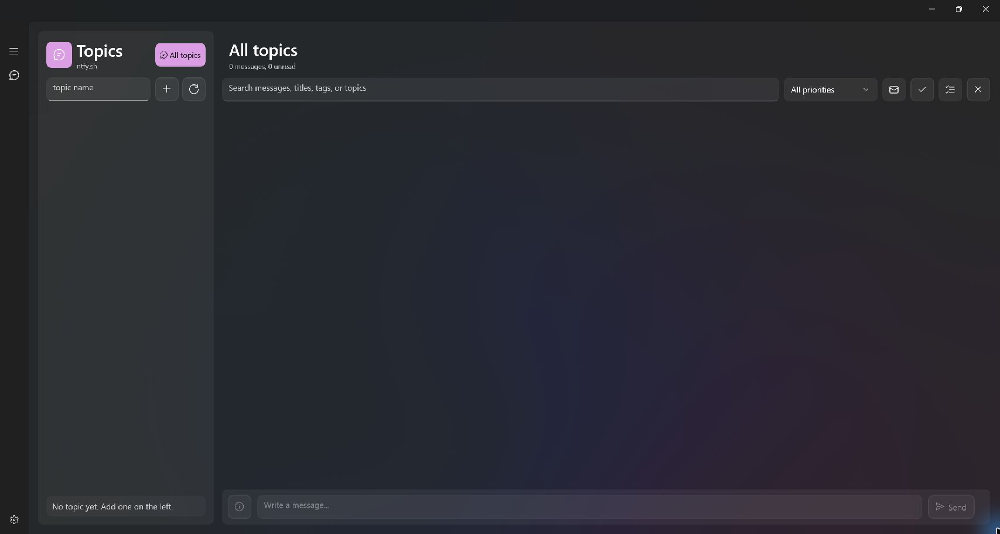

# Vibe Coding by using Codex

# ntfy-windows



Windows 11 style ntfy desktop client (WinUI 3) with:
- authenticated subscriptions (Bearer + Basic)
- modern Fluent UI shell
- send message workflow with reusable templates

## Status
Scaffolded architecture + core services + starter UI pages.

## Planned stack
- WinUI 3 (Windows App SDK)
- .NET 8+
- Local encrypted credentials via DPAPI
- HTTP SSE/JSON stream for ntfy subscribe

## Core features
1. Accounts/Servers
   - Multiple ntfy servers
   - Auth mode per server (Bearer / Basic)
2. Inbox
   - Live message stream per topic
   - Filter/search/priority badges
3. Send
   - Topic, title, message, priority, tags, click URL
4. Templates
   - Save/update/delete templates
   - Token replacement (e.g. {{course}}, {{due_date}})

## Notes
This scaffold is implementation-first (services/models/UI shell). If your machine has WinUI templates installed, we can wire this into a full runnable app quickly.

## Release automation
- GitHub Actions workflow: `.github/workflows/release.yml`
- Manual build: run `Build Release` from Actions; all files are available as workflow artifacts
- Tagged release: push a tag such as `v1.0.0` to create a GitHub Release automatically
- Architectures: `x86`, `x64`, and `ARM64`
- Formats: self-contained portable ZIP and per-machine Inno Setup installer for every architecture
- Installer default: `Program Files\ntfy-windows` (`Program Files (x86)` for x86 on 64-bit Windows)
- Updates reuse the existing registered installation directory, including a custom path selected during setup
- A full uninstall removes the installation directory, local app data, credentials, message history, templates, and the Windows sign-in startup entry

## Updates

The settings page supports Windows sign-in startup, automatic update checks, and manual update checks. Updates are read from the latest GitHub Release, matched to the current architecture, downloaded as an installer, and verified with SHA-256 before launch.

The repository and its GitHub Releases must be publicly readable for installed clients to check for updates without a GitHub access token.


- Tagged releases include `SHA256SUMS.txt`; no signing key is required

### Release integrity

Every tagged release contains:

- `SHA256SUMS.txt` for all portable ZIP and installer files

Verify a downloaded release:

```bash
sha256sum --check SHA256SUMS.txt
```
